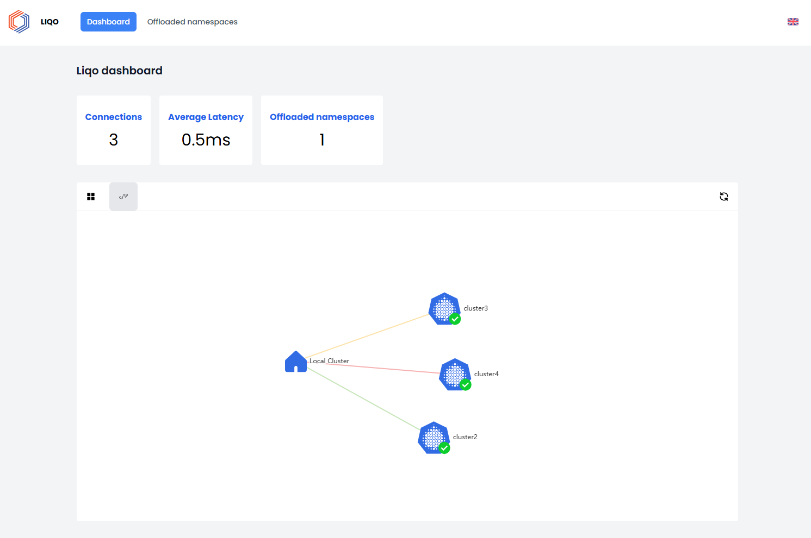

# Liqo UI Frontend

This project is a UI for Liqo made by ArubaKube.

## Features

- Show a graph with the topology of the federation created by liqo
- Show the status of the active peerings with other clusters
- Show the status of the offloaded namespaces in the local liqo node
- Show the status of the pods running in the offloaded namespaces



## Installation

You can install this UI via the [provided Helm Chart](./deployments/).

1. Clone this repository:

    ```bash
    https://github.com/ArubaKube/liqo-dashboard.git
    cd liqo-dashboard
    ```

2. Prerequisites

    - A running cluster with Liqo installed
    - [Metrics server](https://github.com/kubernetes-sigs/metrics-server) installed on the cluster
    - [Helm](https://helm.sh/docs/intro/install/) utility installed on your machine

3. Install the chart

    ```bash
    helm install my-release ./deployments/liqo-dashboard
    ```